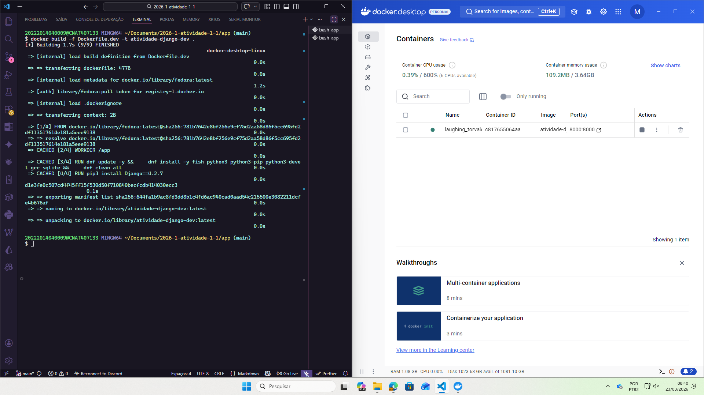
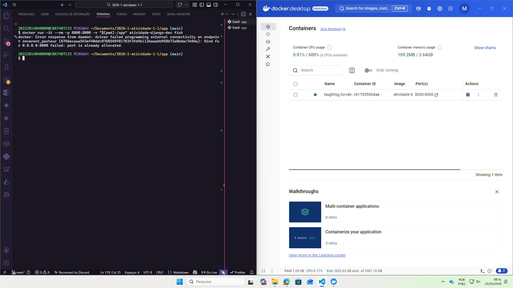
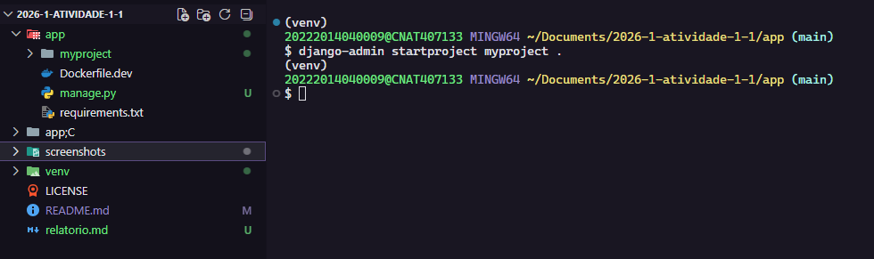
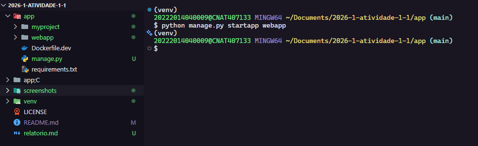
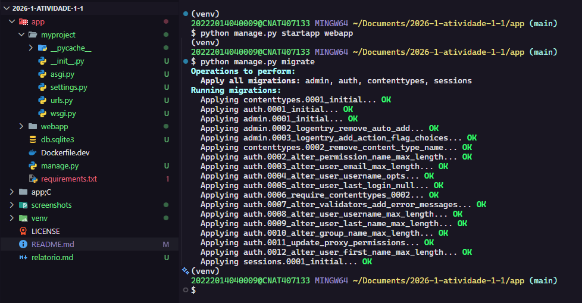
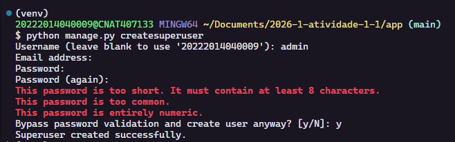
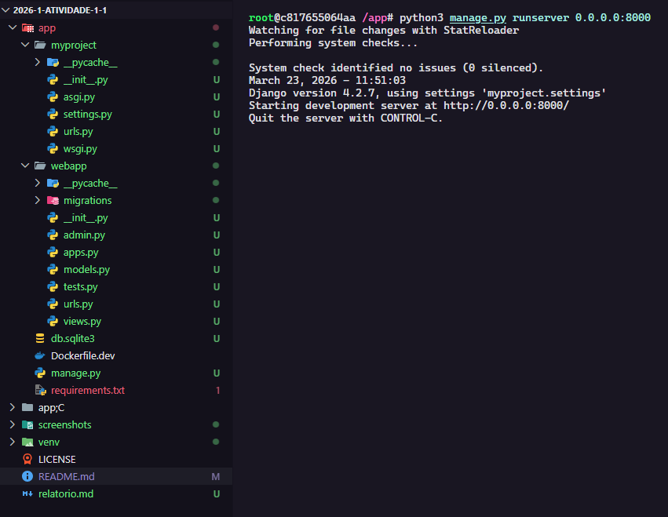
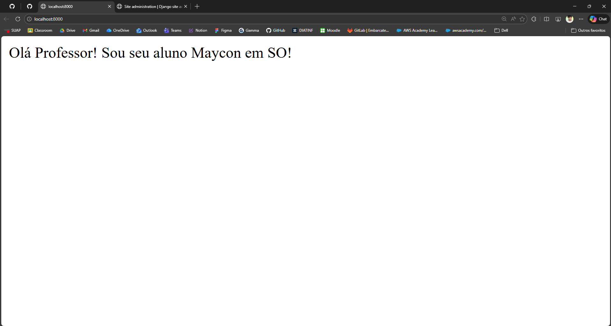
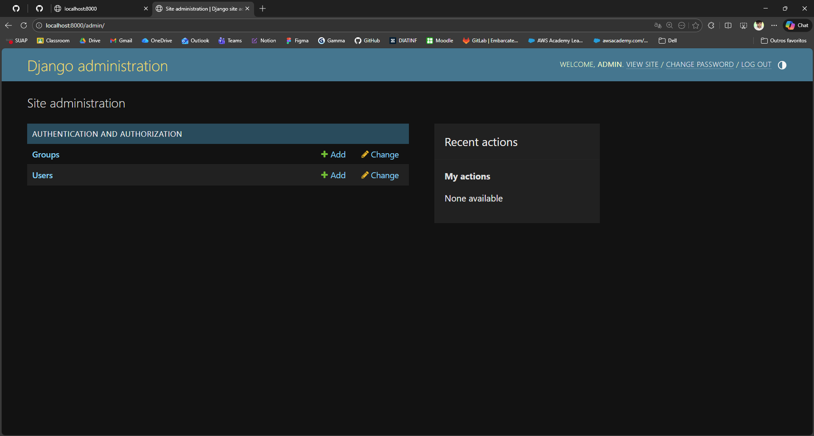

# Avaliação 1.1 - Maycon Alexsander da Silva

## Introdução

Esta avaliação tem como objetivo configurar e utilizar um ambiente de desenvolvimento containerizado utilizando Docker. O propósito é aprender a criar, gerenciar e compartilhar volumes entre a máquina hospedeira e containers, além de praticar a manipulação de arquivos e execução de comandos em um ambiente isolado.

## Relato das Atividades

### Atividades Realizadas

## Considerações Finais

Tive alguns muitos problemas, a começar por um bug não resolvido em que as pastas não estavam sendo compatilhadas entre a máquina hospedeira e o container, mesmo após o comando do passo 2.3. Ocorreu um bug nesse comando, que resultou na criação de uma pasta estranha chamada "app;C" (verifiquei e não foi erro de digitação). Reiniciei a máquina para verificar se o problema iria desaparecer, mas persistiu. Prossegui com as criações e edições dos arquivos via comandos `touch` e `nano` já que os arquivos não estavam visíveis pela máquina hospedeira. Como reiniciei a máquina, acabei perdendo o histórico de comandos, e tive que fazer tudo novamente para poder realizar as capturas de tela. Além disso tudo, tive que fazer todo o tutorial 2x, sendo uma dentro do container com comandos `touch` e `nano` e outra na minha máquina local fora do container.
